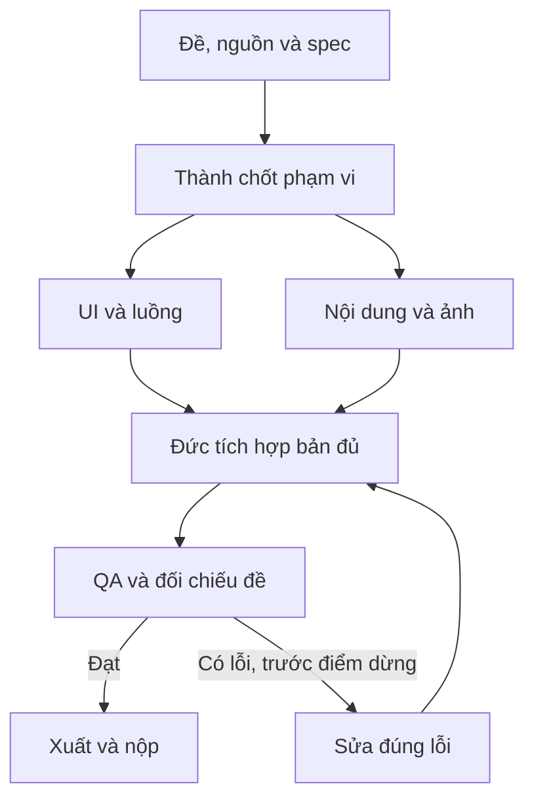

# Pipeline — Website, web app và công cụ AI

[Mục lục plan](../README.md) · [Plan này](README.md) · [Điều hành chung](../_chung/README.md)

## Sơ đồ sản xuất

## Các bước thực hiện

**Pipeline:** (1) Thành xác minh địa danh/khuyến cáo; (2) Đức khóa cấu trúc trang và schema; (3) Hoàng tạo ảnh/nội dung trong khi worker dựng UI; (4) tích hợp và deploy bản đủ; (5) thử luồng trên desktop/mobile, sửa lỗi và đóng gói. Nếu đề cần lưu dữ liệu thật, chọn một nơi lưu đơn giản theo stack đã luyện, kiểm quyền đọc/ghi và lưu qua refresh; không thêm database chỉ để làm demo đẹp.

## Bàn giao cụ thể

| Bước | Người phụ trách | Đầu vào | Đầu ra bàn giao | Chốt kiểm |
| --- | --- | --- | --- | --- |
| 1 | Thành | Đề + nguồn | Nội dung/luồng duyệt | Không thiếu mục bắt buộc |
| 2 | Đức | Luồng + schema | Khung build/deploy | Link mở được ở T+30 |
| 3 | Hoàng | Nội dung + style | JSON/ảnh hoàn chỉnh | Có source_id/asset_id |
| 4 | Đức | UI + JSON + ảnh | Bản đủ | Luồng chạy trọn vẹn |
| 5 | Cả đội | Bản deploy cuối | QA/link/file nộp | Ẩn danh và mobile đạt |

## Phụ thuộc và điểm dừng

Phần quyết định tiến độ: **Chốt schema → luồng hoạt động → deploy → kiểm link**. Nhánh làm nội dung/dữ liệu và nhánh làm khung có thể chạy song song; chỉ tích hợp đầu ra đã duyệt và đúng schema.

Bản đủ trước T+60; nếu còn thiếu yêu cầu bắt buộc thì dừng làm đẹp. Đóng băng nội dung/tính năng ở T+100. Vòng sửa không được kéo sang thời gian chỉ dành cho nộp. Xem [lịch chung](../_chung/03_lich_ngan_sach.md).

Phương án dự phòng: bỏ hiệu ứng 3D và trang phụ; app có thể dùng bộ dữ liệu cục bộ đã duyệt nếu đề cho phép. Nếu AI trực tiếp là bắt buộc, dữ liệu mẫu phải ghi rõ là demo và không thay bằng chứng gọi AI thật.
