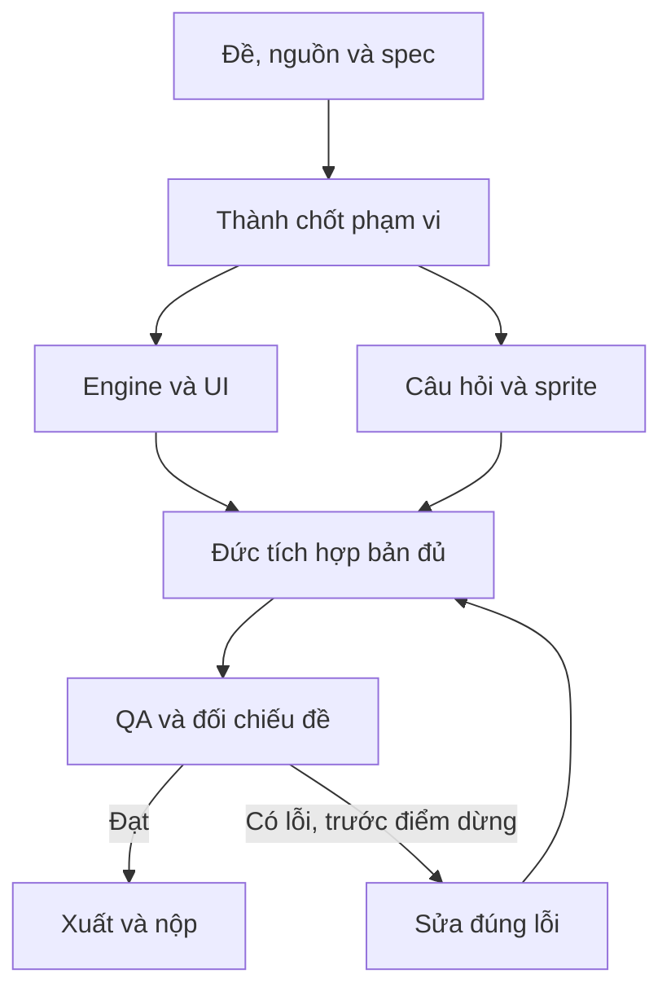

# Pipeline — Game giáo dục

[Mục lục plan](../README.md) · [Plan này](README.md) · [Điều hành chung](../_chung/README.md)

## Sơ đồ sản xuất

## Các bước thực hiện

**Pipeline:** duyệt kiến thức → khóa câu hỏi và luật điểm → worker dựng engine độc lập với ảnh → Hoàng tạo sprite → gắn phản hồi → deploy → thử trả lời đúng/sai, chơi lại và thao tác chạm. Màn mới chỉ thêm sau bản đủ.

## Bàn giao cụ thể

| Bước | Người phụ trách | Đầu vào | Đầu ra bàn giao | Chốt kiểm |
| --- | --- | --- | --- | --- |
| 1 | Thành | Nguồn + độ tuổi | Luật/câu hỏi duyệt | Đáp án đúng và phù hợp tuổi |
| 2 | Đức | Schema + luật | Engine/UI thô | Không phụ thuộc ảnh để chơi |
| 3 | Hoàng | Style + danh sách asset | Sprite/icon | Bộ nhỏ, đồng nhất |
| 4 | Đức | Engine + asset | Một màn hoàn chỉnh | Chơi lại không lỗi |
| 5 | Cả đội | Game deploy | QA/nộp | Chạm/nhấp đôi/điểm đúng |

## Phụ thuộc và điểm dừng

Phần quyết định tiến độ: **Câu hỏi/luật → engine → một màn hoàn chỉnh → deploy**. Nhánh làm nội dung/dữ liệu và nhánh làm khung có thể chạy song song; chỉ tích hợp đầu ra đã duyệt và đúng schema.

Bản đủ trước T+60; nếu còn thiếu yêu cầu bắt buộc thì dừng làm đẹp. Đóng băng nội dung/tính năng ở T+100. Vòng sửa không được kéo sang thời gian chỉ dành cho nộp. Xem [lịch chung](../_chung/03_lich_ngan_sach.md).

Phương án dự phòng: giảm số màn, dùng icon hình học; giữ số câu/màn bắt buộc nếu đề nêu.
