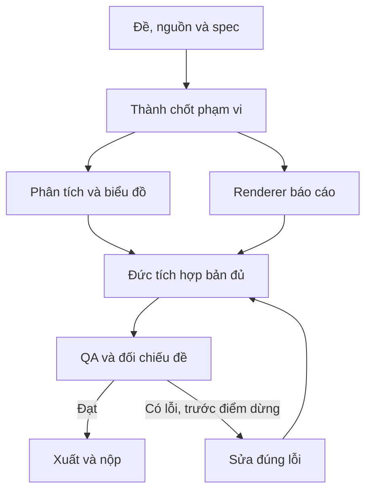

# Pipeline — Báo cáo dữ liệu và tài chính

[Mục lục plan](../README.md) · [Plan này](README.md) · [Điều hành chung](../_chung/README.md)

## Sơ đồ sản xuất

## Các bước thực hiện

**Pipeline:** kiểm dữ liệu gốc → khóa định nghĩa chỉ số → code tính → đối chiếu tổng/đơn vị/kỳ → viết nhận định từ `numbers.json` → dựng báo cáo → render kiểm từng trang. Không để LLM tự điền số thiếu hoặc tự tính thay script.

## Bàn giao cụ thể

| Bước | Người phụ trách | Đầu vào | Đầu ra bàn giao | Chốt kiểm |
| --- | --- | --- | --- | --- |
| 1 | Hoàng | File gốc | Data dictionary/dữ liệu kiểm | Đơn vị và kỳ rõ |
| 2 | Hoàng | Dữ liệu kiểm + công thức | Numbers/charts | Tổng và mẫu số đối chiếu |
| 3 | Đức | Định dạng đề | Renderer/layout | Xuất được file thử |
| 4 | Thành/Hoàng | Numbers có ID | Nhận định duyệt | Tách quan sát/giả định/đề xuất |
| 5 | Đức | Nội dung + chart | PDF/DOCX và QA trang | Số khớp, không bảng tràn |

## Phụ thuộc và điểm dừng

Phần quyết định tiến độ: **Kiểm dữ liệu → tính chỉ số → duyệt nhận định → xuất báo cáo**. Nhánh làm nội dung/dữ liệu và nhánh làm khung có thể chạy song song; chỉ tích hợp đầu ra đã duyệt và đúng schema.

Bản đủ trước T+60; nếu còn thiếu yêu cầu bắt buộc thì dừng làm đẹp. Đóng băng nội dung/tính năng ở T+100. Vòng sửa không được kéo sang thời gian chỉ dành cho nộp. Xem [lịch chung](../_chung/03_lich_ngan_sach.md).

Phương án dự phòng: bỏ dashboard tùy chọn, giữ báo cáo bắt buộc; dữ liệu lỗi thì phân tích phần hợp lệ và ghi rõ phạm vi, không bù bằng số bịa.
