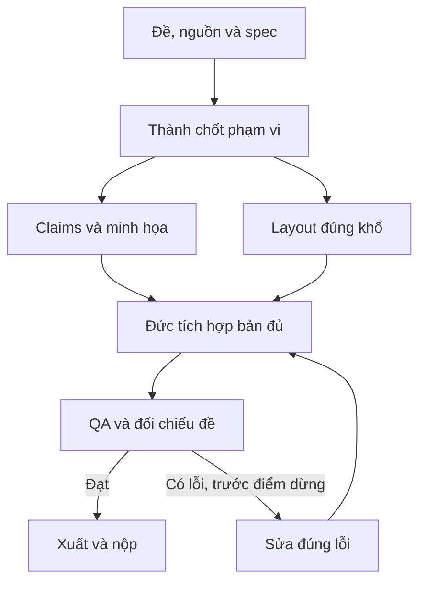

# Pipeline — Infographic pháp luật và chính sách

[Mục lục plan](../README.md) · [Plan này](README.md) · [Điều hành chung](../_chung/README.md)

## Sơ đồ sản xuất

## Các bước thực hiện

**Pipeline:** Thành kiểm phiên bản văn bản → Hoàng trích ý ngắn → Thành duyệt từng khẳng định → Đức dựng bố cục song song với Hoàng sinh hình → xuất ảnh → so chữ và nguồn. Phần kiểm pháp lý chặn phần xuất cuối, không chặn việc dựng layout rỗng.

## Bàn giao cụ thể

| Bước | Người phụ trách | Đầu vào | Đầu ra bàn giao | Chốt kiểm |
| --- | --- | --- | --- | --- |
| 1 | Thành | Văn bản gốc | Nguồn/claims duyệt | Đúng phiên bản, hiệu lực |
| 2 | Hoàng | Claims | Nội dung rút gọn | Không đổi nghĩa |
| 3 | Đức | Khổ + style | Layout rỗng | Đúng kích thước |
| 4 | Hoàng/Đức | Ảnh + nội dung | Bản xuất đầu | Đủ khối đề yêu cầu |
| 5 | Thành | Bản cuối | QA pháp lý/chữ | Nguồn, dấu và ngoại lệ đúng |

## Phụ thuộc và điểm dừng

Phần quyết định tiến độ: **Khẳng định đúng → câu rút gọn duyệt → layout → export**. Nhánh làm nội dung/dữ liệu và nhánh làm khung có thể chạy song song; chỉ tích hợp đầu ra đã duyệt và đúng schema.

Bản đủ trước T+60; nếu còn thiếu yêu cầu bắt buộc thì dừng làm đẹp. Đóng băng nội dung/tính năng ở T+100. Vòng sửa không được kéo sang thời gian chỉ dành cho nộp. Xem [lịch chung](../_chung/03_lich_ngan_sach.md).

Phương án dự phòng: thay ảnh bằng icon đơn giản, bỏ trang trí; không cắt nguồn hoặc bỏ ngoại lệ để tiết kiệm diện tích.
