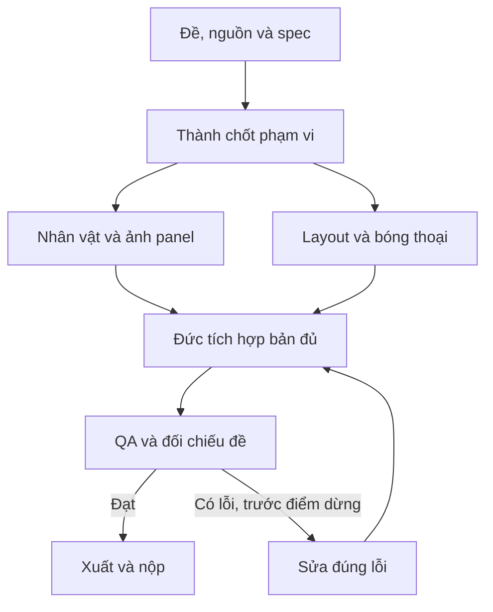

# Pipeline — Truyện tranh giáo dục và cảnh báo

[Mục lục plan](../README.md) · [Plan này](README.md) · [Điều hành chung](../_chung/README.md)

## Sơ đồ sản xuất

## Các bước thực hiện

**Pipeline:** kịch bản → Thành duyệt bài học → ảnh tham chiếu nhân vật → thử một panel → sinh phần còn lại → lắp thoại bằng code → kiểm chuỗi câu chuyện. Giữ tên file theo ID để thay một khung không làm xáo trộn cả truyện.

## Bàn giao cụ thể

| Bước | Người phụ trách | Đầu vào | Đầu ra bàn giao | Chốt kiểm |
| --- | --- | --- | --- | --- |
| 1 | Thành/Hoàng | Chủ đề + đối tượng | Kịch bản duyệt | Bài học rõ, không đổ lỗi |
| 2 | Hoàng | Characters/style | Tham chiếu + panel thử | Nhân vật ổn định |
| 3 | Đức | Khổ + số trang | Layout/bóng thoại | Không phụ thuộc sinh đủ ảnh |
| 4 | Hoàng/Đức | Các panel + thoại | Truyện đủ | Không thiếu khung bắt buộc |
| 5 | Cả đội | Truyện cuối | QA hình/chữ/mạch truyện | Đọc rõ, thứ tự đúng |

## Phụ thuộc và điểm dừng

Phần quyết định tiến độ: **Kịch bản duyệt → panel thử → đủ panel → ghép thoại**. Nhánh làm nội dung/dữ liệu và nhánh làm khung có thể chạy song song; chỉ tích hợp đầu ra đã duyệt và đúng schema.

Bản đủ trước T+60; nếu còn thiếu yêu cầu bắt buộc thì dừng làm đẹp. Đóng băng nội dung/tính năng ở T+100. Vòng sửa không được kéo sang thời gian chỉ dành cho nộp. Xem [lịch chung](../_chung/03_lich_ngan_sach.md).

Phương án dự phòng: giảm chi tiết nền và dùng một nhân vật chính; tối đa hai lần sinh lại mỗi khung trước khi đơn giản hóa hình. Không giảm số khung bắt buộc.
