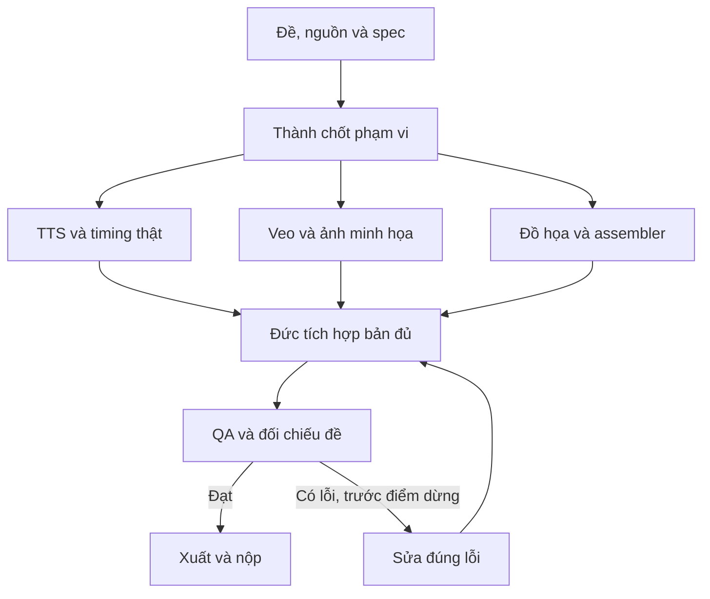

# Pipeline — Video: bản tin, quảng cáo và phim ngắn

[Mục lục plan](../README.md) · [Plan này](README.md) · [Điều hành chung](../_chung/README.md)

## Sơ đồ sản xuất

## Các bước thực hiện

**Pipeline có phụ thuộc:**

1. Thành chốt nội dung, Hoàng lập storyboard và gửi cảnh thử sớm. Đức dựng assembler bằng clip/ảnh mẫu trong ca làm.
2. Hoàng sinh lời đọc đã duyệt; đo thời lượng bằng công cụ. Điều chỉnh kịch bản hoặc timeline theo audio thật, không chỉ đoán qua số từ.
3. Cảnh Veo tốn thời gian chạy song song với TTS và đồ họa; lưu ID ngay. Poll tác vụ đã tạo, không tạo lại khi chỉ lỗi tải về/truy vấn trạng thái.
4. Đức chuẩn hóa kích thước/fps, gắn cảnh với lời, lắp phụ đề và nhạc được phép. Số liệu/tên tiếng Việt dựng bằng code.
5. Xem/nghe toàn video, kiểm thời lượng và export codec/khung hình theo đề. Hình AI giả tư liệu thật phải được nhận diện là minh họa.

## Bàn giao cụ thể

| Bước | Người phụ trách | Đầu vào | Đầu ra bàn giao | Chốt kiểm |
| --- | --- | --- | --- | --- |
| 1 | Thành/Hoàng | Đề + nguồn | Script/storyboard duyệt | Chọn đúng nhánh video |
| 2 | Hoàng | Lời duyệt | TTS/audio đo duration | Đọc đúng tên/số |
| 3 | Hoàng | Storyboard + style | Veo/ảnh + job ID | Gửi sớm, quản lý budget |
| 4 | Đức | Audio + media nhận được | Timeline/render đủ | Không cắt mất lời |
| 5 | Cả đội | Video cuối | QA và export | Hình/tiếng/phụ đề khớp |

## Phụ thuộc và điểm dừng

Phần quyết định tiến độ: **Audio thực + media đã nhận → timeline → render → QA toàn bộ**. Nhánh làm nội dung/dữ liệu và nhánh làm khung có thể chạy song song; chỉ tích hợp đầu ra đã duyệt và đúng schema.

Bản đủ trước T+60; nếu còn thiếu yêu cầu bắt buộc thì dừng làm đẹp. Đóng băng nội dung/tính năng ở T+100. Vòng sửa không được kéo sang thời gian chỉ dành cho nộp. Xem [lịch chung](../_chung/03_lich_ngan_sach.md).

Phương án dự phòng: dùng ảnh chuyển động/đồ họa thay cảnh trễ nếu đề cho phép; nếu đề bắt buộc clip AI, giữ số cảnh bắt buộc, ưu tiên render đã nhận và cắt trang trí khác.
