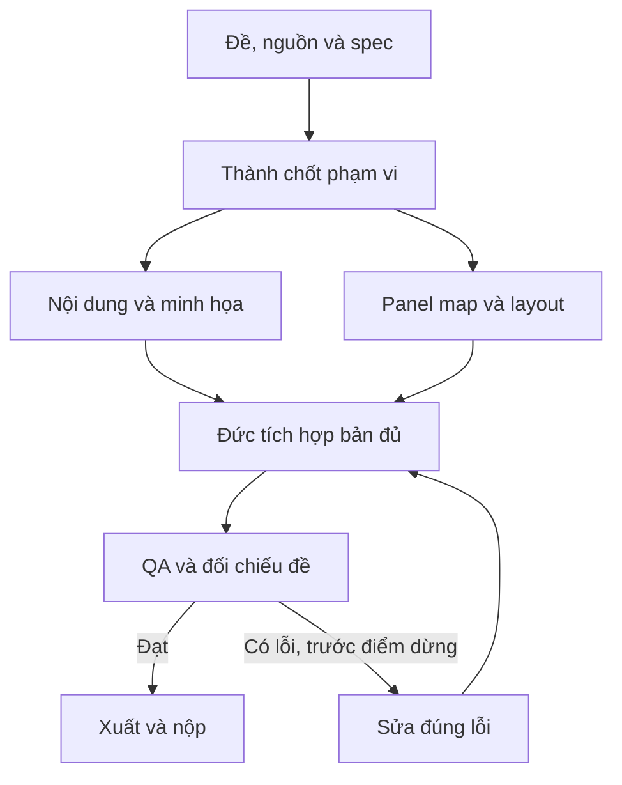

# Pipeline — Tờ gấp truyền thông và hướng dẫn

[Mục lục plan](../README.md) · [Plan này](README.md) · [Điều hành chung](../_chung/README.md)

## Sơ đồ sản xuất

## Các bước thực hiện

**Pipeline:** khóa kiểu gấp → Thành duyệt thông tin/hotline → Hoàng chia nội dung theo vai panel → Đức dựng hai mặt → lắp hình → xuất PDF và mô phỏng gấp. Không mặc định mặt ngoài đọc trái sang phải như mặt trong; chốt sơ đồ theo chiều gấp thực tế. Nếu đề yêu cầu file sẵn sàng nhà in, dùng thông số lề/bleed nhà in cung cấp.

## Bàn giao cụ thể

| Bước | Người phụ trách | Đầu vào | Đầu ra bàn giao | Chốt kiểm |
| --- | --- | --- | --- | --- |
| 1 | Đức/Thành | Kiểu gấp | Panel map | Bìa/mặt sau đúng vị trí |
| 2 | Thành/Hoàng | Nguồn | Nội dung từng panel | Khuyến cáo/hotline đúng |
| 3 | Đức | Panel map + khổ | Layout hai mặt | Vùng gấp an toàn |
| 4 | Hoàng/Đức | Ảnh + nội dung | PDF đầu | Đủ cả hai mặt |
| 5 | Cả đội | Preview khổ thật | QA gấp/xuất cuối | Đọc đúng thứ tự |

## Phụ thuộc và điểm dừng

Phần quyết định tiến độ: **Panel map → nội dung → hai mặt → mô phỏng gấp**. Nhánh làm nội dung/dữ liệu và nhánh làm khung có thể chạy song song; chỉ tích hợp đầu ra đã duyệt và đúng schema.

Bản đủ trước T+60; nếu còn thiếu yêu cầu bắt buộc thì dừng làm đẹp. Đóng băng nội dung/tính năng ở T+100. Vòng sửa không được kéo sang thời gian chỉ dành cho nộp. Xem [lịch chung](../_chung/03_lich_ngan_sach.md).

Phương án dự phòng: hình phẳng đơn giản và ít ảnh; giữ panel/hotline/thông tin bắt buộc.
