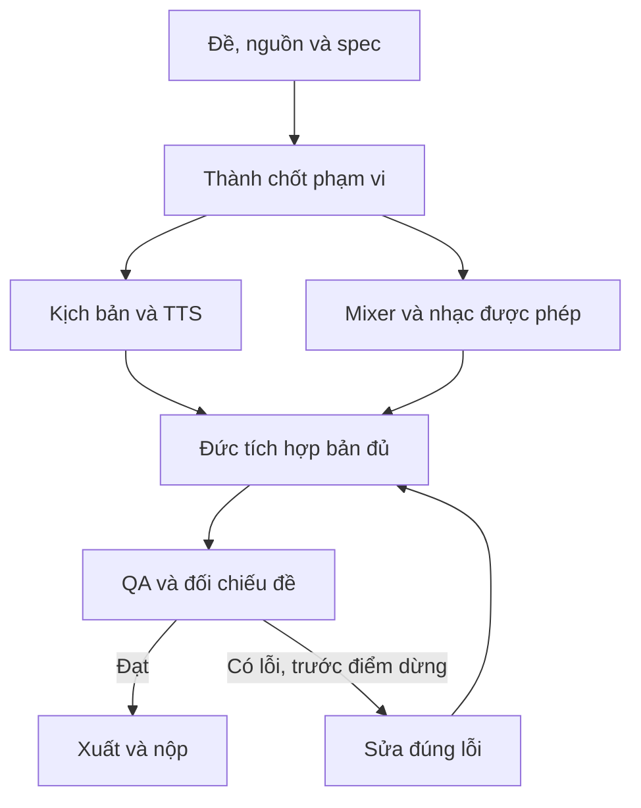

# Pipeline — Podcast tư vấn, giáo dục và kể chuyện

[Mục lục plan](../README.md) · [Plan này](README.md) · [Điều hành chung](../_chung/README.md)

## Sơ đồ sản xuất

## Các bước thực hiện

**Pipeline:** khóa kịch bản → thử một đoạn mỗi giọng → đo thời lượng → sửa kịch bản nếu lệch → sinh các đoạn đã duyệt → nối và mix → nghe toàn bộ. Chia mỗi đoạn 1–3 câu theo lượt người nói; không gửi một bài dài duy nhất rồi phải sinh lại toàn bộ khi sai một câu.

## Bàn giao cụ thể

| Bước | Người phụ trách | Đầu vào | Đầu ra bàn giao | Chốt kiểm |
| --- | --- | --- | --- | --- |
| 1 | Thành/Hoàng | Chủ đề + nguồn | Dialogue duyệt | Người nghe hiểu bằng âm thanh |
| 2 | Hoàng | Đoạn mẫu + voices | Giọng/timing chốt | Đọc đúng tên/số |
| 3 | Hoàng | Dialogue duyệt | Audio từng đoạn | ID/thứ tự đầy đủ |
| 4 | Đức | Manifest + music | Podcast hoàn chỉnh | Nhạc thấp hơn giọng |
| 5 | Cả đội | Audio cuối | QA và transcript | Không thiếu/lặp đoạn |

## Phụ thuộc và điểm dừng

Phần quyết định tiến độ: **Thử giọng → audio từng đoạn → mix → nghe toàn bài**. Nhánh làm nội dung/dữ liệu và nhánh làm khung có thể chạy song song; chỉ tích hợp đầu ra đã duyệt và đúng schema.

Bản đủ trước T+60; nếu còn thiếu yêu cầu bắt buộc thì dừng làm đẹp. Đóng băng nội dung/tính năng ở T+100. Vòng sửa không được kéo sang thời gian chỉ dành cho nộp. Xem [lịch chung](../_chung/03_lich_ngan_sach.md).

Phương án dự phòng: bỏ nhạc hoặc bìa tùy chọn, không cắt đoạn bắt buộc; chỉ chuyển hai vai thành một nếu đề cho phép.
