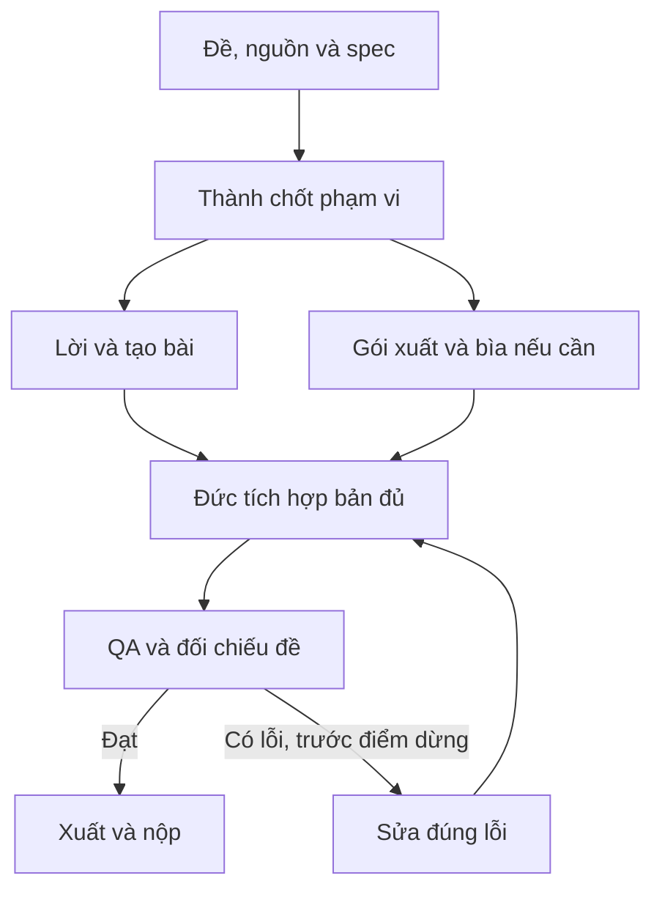

# Pipeline — Sáng tác bài hát

[Mục lục plan](../README.md) · [Plan này](README.md) · [Điều hành chung](../_chung/README.md)

## Sơ đồ sản xuất

## Các bước thực hiện

**Pipeline:** chốt từ khóa bắt buộc → viết điệp khúc → Thành duyệt → hoàn thiện verse/bridge → sinh hai bản nếu quota cho phép → nghe rõ từng chữ → chọn bản đạt đề → chuẩn hóa/export. Không tốn thời gian làm lyric video khi bài hát chính chưa đạt.

## Bàn giao cụ thể

| Bước | Người phụ trách | Đầu vào | Đầu ra bàn giao | Chốt kiểm |
| --- | --- | --- | --- | --- |
| 1 | Thành/Hoàng | Đề + từ khóa | Lyrics/style duyệt | Chorus rõ, tên đúng |
| 2 | Hoàng | Lyrics/style | Các bản theo quota | Tạo đủ sớm |
| 3 | Thành/Hoàng | Audio tạo được | Bản chọn đạt đề | Nghe đúng từng từ khóa |
| 4 | Đức | Audio chọn + lyrics | Gói xuất | Định dạng/thời lượng đúng |
| 5 | Cả đội | Audio cuối + lời | QA/nộp | Lời khớp và kết bài đủ |

## Phụ thuộc và điểm dừng

Phần quyết định tiến độ: **Lời duyệt → tạo bản audio → nghe/chọn → export**. Nhánh làm nội dung/dữ liệu và nhánh làm khung có thể chạy song song; chỉ tích hợp đầu ra đã duyệt và đúng schema.

Bản đủ trước T+60; nếu còn thiếu yêu cầu bắt buộc thì dừng làm đẹp. Đóng băng nội dung/tính năng ở T+100. Vòng sửa không được kéo sang thời gian chỉ dành cho nộp. Xem [lịch chung](../_chung/03_lich_ngan_sach.md).

Phương án dự phòng: ưu tiên bản rõ lời hơn bản nhiều hiệu ứng; bỏ media bổ sung tùy chọn. Nếu hết quota mà chưa có bài đạt, báo đúng giới hạn; không lấy bài có sẵn làm bài sáng tác mới.
