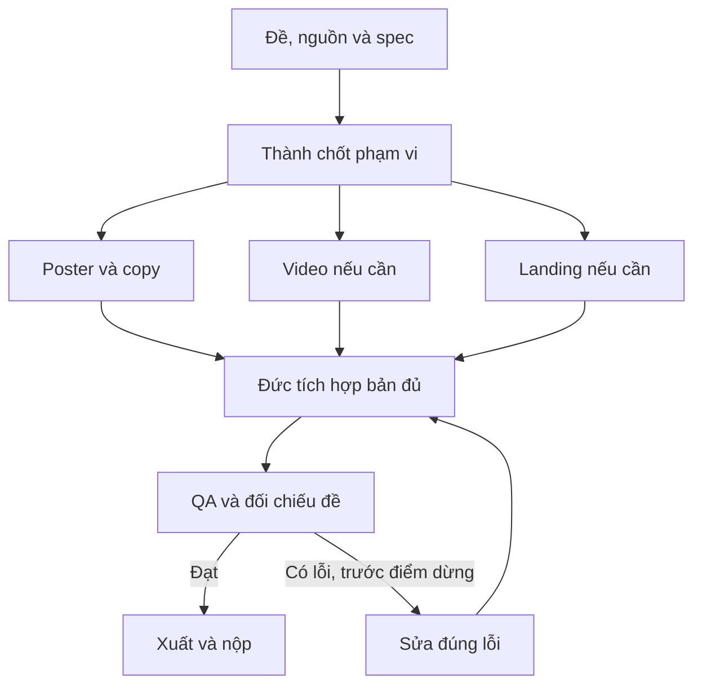

# Pipeline — Chiến dịch đa định dạng và poster

[Mục lục plan](../README.md) · [Plan này](README.md) · [Điều hành chung](../_chung/README.md)

## Sơ đồ sản xuất

## Các bước thực hiện

**Pipeline:** đề → insight và thông điệp → khóa bộ nhận diện → triển khai song song các nhánh → kiểm từng sản phẩm → kiểm sự nhất quán toàn bộ → gói nộp. Dùng chung một nội dung nguồn, không để mỗi worker tự nghĩ slogan khác nhau.

## Bàn giao cụ thể

| Bước | Người phụ trách | Đầu vào | Đầu ra bàn giao | Chốt kiểm |
| --- | --- | --- | --- | --- |
| 1 | Thành/Hoàng | Brief + nguồn | Thông điệp và ma trận duyệt | Không thiếu sản phẩm bắt buộc |
| 2 | Hoàng | Nhận diện chung | Copy/ảnh/TTS/Veo cần dùng | Cùng slogan và style |
| 3 | Đức/workers | ID sản phẩm + đầu vào | Poster/video/web theo nhánh | Mỗi nhánh có bản đủ |
| 4 | Cả đội | Từng file | QA từng sản phẩm | Format/khổ/duration đạt |
| 5 | Thành/Đức | Toàn bộ bộ sản phẩm | QA nhất quán + gói | Ma trận đủ và thông điệp thống nhất |

## Phụ thuộc và điểm dừng

Phần quyết định tiến độ: **Thông điệp/ma trận → các nhánh → QA từng file → QA cả bộ**. Nhánh làm nội dung/dữ liệu và nhánh làm khung có thể chạy song song; chỉ tích hợp đầu ra đã duyệt và đúng schema.

Bản đủ trước T+60; nếu còn thiếu yêu cầu bắt buộc thì dừng làm đẹp. Đóng băng nội dung/tính năng ở T+100. Vòng sửa không được kéo sang thời gian chỉ dành cho nộp. Xem [lịch chung](../_chung/03_lich_ngan_sach.md).

Phương án dự phòng: giảm hiệu ứng, số lượt sinh và biến thể tùy chọn; giữ mọi sản phẩm bắt buộc. Poster độc lập không cần phát triển video/landing.
