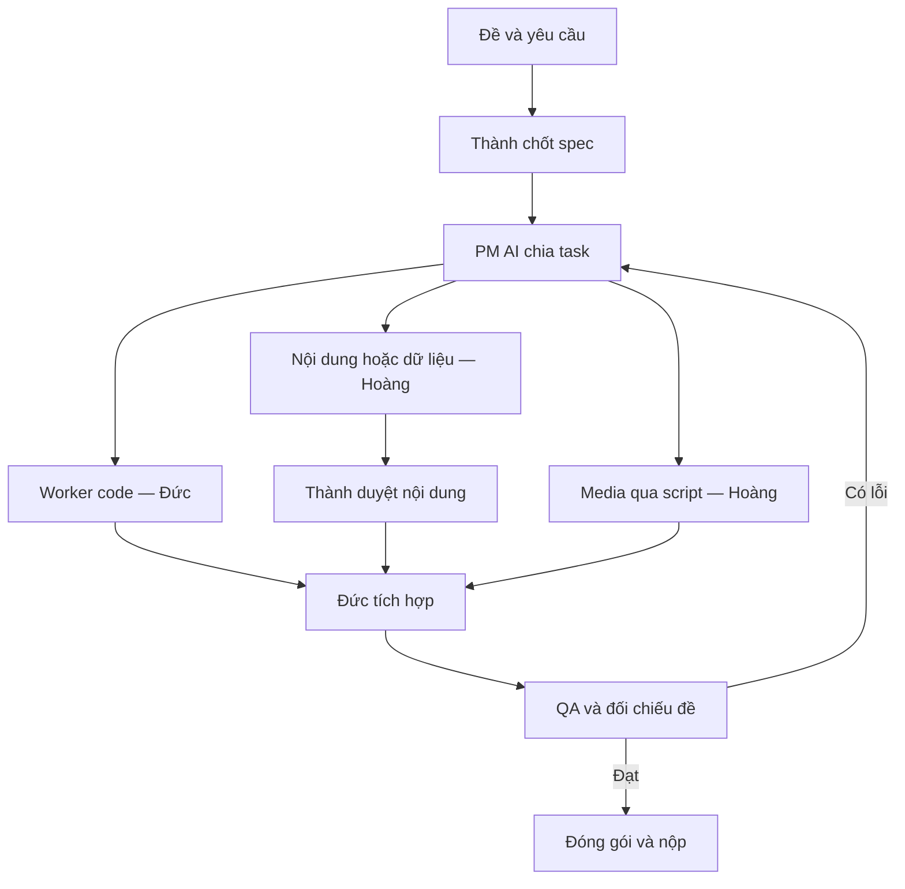

# Harness và phân vai chung

[Mục lục plan](../README.md) · [Hướng dẫn chung](README.md)

Ba vai người giữ nguyên trong mọi dạng đề. Số agent điều chỉnh theo công việc; không cần mở ba worker nếu sản phẩm chỉ có một file nhỏ.

| Người | Trách nhiệm chính | Quyết định sở hữu |
| --- | --- | --- |
| Thành — đội trưởng/Product & Evaluation | Đọc đề, chốt ý tưởng, xác minh nguồn, duyệt nội dung, theo dõi checklist | Phạm vi sản phẩm và chất lượng nội dung |
| Hoàng — AI & Data, máy B | Tạo nội dung/media; với đề dữ liệu thì làm phân tích | Prompt nội dung, nguồn dữ liệu, tài nguyên và manifest |
| Đức — Systems/Backend, máy A | Harness, dựng/lắp ráp, deploy hoặc xuất file, budget và gói nộp | Tích hợp kỹ thuật, luồng chạy và phiên bản nộp |

**Model theo vai:** PM/reviewer dùng `gpt-6.1-sol` khi cần suy luận; worker code dùng `gpt-6-luna`; nội dung dùng Gemini Flash đã thử tiếng Việt; ảnh dùng `nano-banana-2-lite`, chỉ nâng Pro cho ảnh quan trọng; giọng dùng Gemini Flash TTS. Video thử `veo-3.1-lite-generate-001`, cảnh cuối cân nhắc Fast. Đây là lựa chọn đề xuất, phải kiểm tra danh sách model khả dụng cho key của đội. [BTC-03, BTC-05, BTC-07, BTC-08]

**Quy tắc chạy harness:**

1. Mỗi task khoảng 10–15 phút, ghi file được sửa và điều kiện hoàn thành. PM lập kế hoạch ở T+15, rà ở T+60 và T+95; review sớm hơn nếu một lỗi chặn tiến độ.
2. Tối đa hai worker code đang sửa cùng lúc; mỗi worker sở hữu file khác nhau. Khóa phiên bản schema trước khi chia việc. Một người tích hợp và commit; máy còn lại pull sau khi được báo, không sửa cùng file.
3. Agent làm việc từ gốc repo, đọc rõ `chung-khao/AGENTS.md`. Không sửa thư mục vòng khác, README gốc, hook BTC hay secret nếu không có nhiệm vụ được phép.
4. Một hàng đợi media điều phối hai máy; mặc định khoảng sáu request đang chạy cho key chung, kể cả agent và polling, để có dư địa dưới trần. Khi 429 tốc độ thì backoff; khi hết budget thì dừng sinh mới.
5. Worker lỗi hai lần ở cùng task: giao đúng task cho model mạnh một lần. Nếu vẫn lỗi, người cắt phạm vi hoặc dùng phương án dự phòng.
6. Hook BTC giữ log gốc tự động. Script media lưu prompt, model, ID, trạng thái và kết quả thật vào `chung-khao/logs/api_calls.jsonl` để đối chiếu; đây là bằng chứng bổ sung, không thay log hook phải gửi BTC. Không sửa/thêm log hook bằng tay.

**Hợp đồng file dùng chung** — tạo theo nhu cầu của đề, không bắt buộc dựng mọi thư mục:

| Đường dẫn trong `chung-khao/` | Nội dung | Người/worker ghi |
| --- | --- | --- |
| `AGENTS.md`, `brief.md`, `requirements.json` | Đề nguyên văn, yêu cầu có ID, phạm vi, định dạng, tiêu chí xong | Đức ghi sau khi Thành chốt |
| `tasks/` | Task card, phụ thuộc và file được sửa | PM AI, Đức điều phối |
| `sources.md`, `data/` | Nguồn, ngày truy cập/hiệu lực, dữ liệu gốc và nội dung duyệt | Thành duyệt, Hoàng cập nhật |
| `prompts/`, `assets/manifest.json` | Prompt thực tế; ánh xạ ID tài nguyên → file → trạng thái → lượt sinh | Hoàng |
| `src/`, `scripts/` | Mã sản phẩm, phân tích, sinh media và xuất file | Worker theo task card |
| `out/`, `qa/`, `submission.md` | Bản nháp/bản cuối, kết quả kiểm tra, ánh xạ yêu cầu → file/link nộp | Đức, reviewer chỉ báo lỗi |

Không di chuyển bộ hook khỏi gốc repo. Không xem `logs/` hoặc `prompts/` tự tạo là thay thế cho `.ai-log/`. Key chỉ đọc từ biến môi trường khi script chạy; agent không đọc `.env`.
